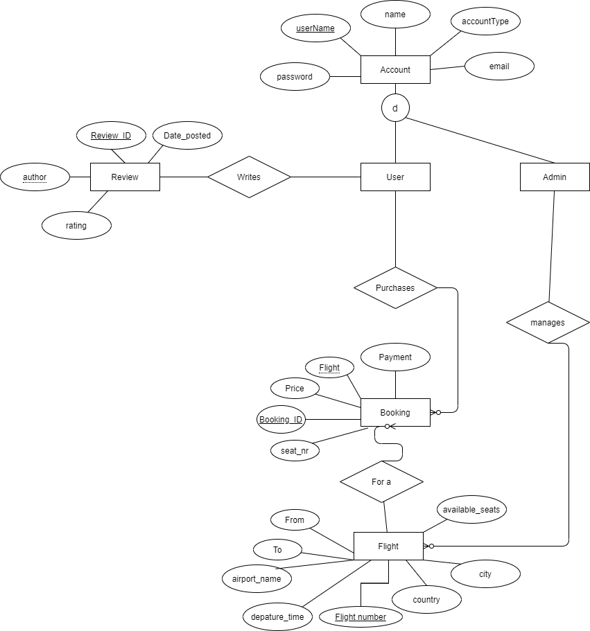
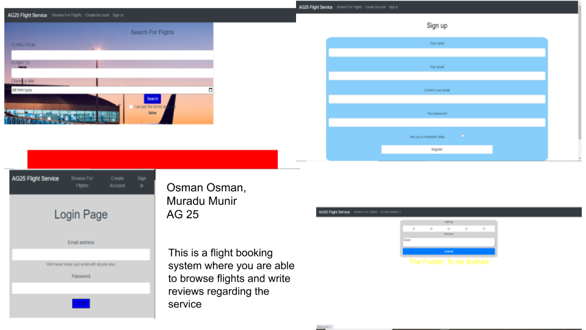

# Backend and Frontend Template

Latest version: https://git.ita.chalmers.se/courses/dit341/group-00-web (public Github [mirror](https://github.com/dit341/group-00-web))

## Project Structure

| File        | Purpose           | What you do?  |
| ------------- | ------------- | ----- |
| `server/` | Backend server code | All your server code |
| [server/README.md](server/README.md) | Everything about the server | **READ ME** carefully! |
| `client/` | Frontend client code | All your client code |
| [client/README.md](client/README.md) | Everything about the client | **READ ME** carefully! |
| [docs/DEPLOYMENT.md](docs/DEPLOYMENT.md) | Free online production deployment | Deploy your app online in production mode |
| [docs/LOCAL_DEPLOYMENT.md](docs/LOCAL_DEPLOYMENT.md) | Local production deployment | Deploy your app local in production mode |

## Requirements

The version numbers in brackets indicate the tested versions but feel free to use more recent versions.
You can also use alternative tools if you know how to configure them (e.g., Firefox instead of Chrome).

* [Git](https://git-scm.com/) (v2) => [installation instructions](https://www.atlassian.com/git/tutorials/install-git)
  * [Add your Git username and set your email](https://docs.gitlab.com/ce/gitlab-basics/start-using-git.html#add-your-git-username-and-set-your-email)
    * `git config --global user.name "YOUR_USERNAME"` => check `git config --global user.name`
    * `git config --global user.email "email@example.com"` => check `git config --global user.email`
  * > **Windows users**: We recommend to use the [Git Bash](https://www.atlassian.com/git/tutorials/git-bash) shell from your Git installation or the Bash shell from the [Windows Subsystem for Linux](https://docs.microsoft.com/en-us/windows/wsl/install-win10) to run all shell commands for this project.
* [Chalmers GitLab](https://git.ita.chalmers.se/) => Login with your **Chalmers CID** choosing "Sign in with" **Chalmers Login**. (contact [support@chalmers.se](mailto:support@chalmers.se) if you don't have one)
  * DIT341 course group: https://git.ita.chalmers.se/courses/dit341
  * [Setup SSH key with Gitlab](https://docs.gitlab.com/ee/ssh/)
    * Create an SSH key pair `ssh-keygen -t ed25519 -C "email@example.com"` (skip if you already have one)
    * Add your public SSH key to your Gitlab profile under https://git.ita.chalmers.se/profile/keys
    * Make sure the email you use to commit is registered under https://git.ita.chalmers.se/profile/emails
  * Checkout the [Backend-Frontend](https://git.ita.chalmers.se/courses/dit341/group-00-web) template `git clone git@git.ita.chalmers.se:courses/dit341/group-00-web.git`
* [Server Requirements](./server/README.md#Requirements)
* [Client Requirements](./client/README.md#Requirements)

## Getting started

```bash
# Clone repository
git clone git@git.ita.chalmers.se:courses/dit341/group-00-web.git

# Change into the directory
cd group-00-web

# Setup backend
cd server && npm install
npm run dev

# Setup frontend
cd client && npm install
npm run serve
```

> Check out the detailed instructions for [backend](./server/README.md) and [frontend](./client/README.md).

## Visual Studio Code (VSCode)

Open the `server` and `client` in separate VSCode workspaces or open the combined [backend-frontend.code-workspace](./backend-frontend.code-workspace). Otherwise, workspace-specific settings don't work properly.

## System Definition (MS0)

### Purpose

The purpose of this project is to make an metasearch engine for airplane tickets online. The final product should allow users to find and buy tickets, and also write reviews for the service. Moderators on the other hand will be able to schedule flights.

### Pages

* Home Page: The user should see a sign in button as well as a "from" - "to" text boxes that allows the user to search for flights. They should also be able to read written reviews by existing users.
* Loggedin User: Logged in users should be able to also purchase tickets for an existing flight, which will prompt them to a purchasing window. They should also be able to see purchased tickets, and write reviews for the company's service. The login button should now be replaced with a log out button.
* Loggedin Moderator: Logged in moderators should recieve more detailed results of the flight including flight ID, as well as buttons that will allow them to add, change and remove flights.


### Entity-Relationship (ER) Diagram



## Teaser (MS3)


# flight-system
